# brainstorm

Turn ideas into approved designs through structured collaborative dialogue.
Save the result as a structured observation in engram and either hand off
to SDD or close out as a standalone record.

> ⚠️ **HARD GATE — MANDATORY**
>
> Do NOT invoke any implementation skill, write any code, scaffold any
> project, or take any implementation action until you have presented a
> written design summary AND the user has explicitly approved it. This
> applies to EVERY project regardless of perceived simplicity. "Simple"
> projects are exactly where unexamined assumptions cause the most wasted
> work.

## Anti-pattern: "This Is Too Simple To Need A Design"

Every idea goes through this process. A skill tweak, a tiny utility, a
single config change — all of them. The design can be short (a few
sentences for truly simple work), but you MUST present it and get user
approval before transitioning to anything that consumes more tokens or
writes code.

## The Two Exits

Brainstorm has two terminal states. The agent chooses based on what the
conversation produces.

| Exit | When | What happens |
|------|------|--------------|
| **SDD continuation** | The approved design will become real code (a new feature, refactor, fix that needs spec → design → tasks → apply). | Save observation under `sdd/{change-name}/brainstorm`, then hand off to `/sdd-new` (or invoke `sdd-propose` directly if the orchestrator allows it). |
| **Short close** | The idea is exploratory, a one-off note, a strategic discussion, or a decision that doesn't need full SDD machinery (e.g., "should we use library X or Y", "is this feature worth doing"). | Save observation under `brainstorm/{topic}` and stop. No SDD invocation. |

You do not need to pick the exit up front. Decide AFTER the design is
approved, based on whether the next natural step is "write the code" (SDD)
or "remember this and move on" (short close).

## Process — 9-step checklist

You MUST complete these in order. Skip nothing.

1. **Explore project context** — recent commits, related observations
   (`mem_search` with topic keywords), open files. 2-5 minutes max. Don't
   stall here.
2. **Scope check** — if the user's request describes multiple independent
   subsystems, flag it. Help decompose into sub-projects. Each sub-project
   gets its own brainstorm.
3. **Ask clarifying questions, one at a time** — multiple-choice preferred
   when possible. Focus: purpose, constraints, success criteria. Stop
   asking when you can write a first design draft.
4. **Propose 2-3 approaches with tradeoffs** — name them, list pros/cons,
   give your recommendation and why.
5. **Present the design in sections, asking after each** — architecture,
   components/data flow, edge cases, testing. Scale each section to
   complexity: one sentence for trivial, a paragraph for nuanced.
6. **Decide the exit** — SDD continuation or short close. Tell the user
   which exit you picked and why.
7. **Save to engram** — see the Engram Save section below for the exact
   shape per exit.
8. **Emit the URL** — after the save returns the observation id, emit
   `Review: http://localhost:7438/m/{id}` so the user can open the saved
   record in engram-ui.
9. **Transition** — for SDD continuation, invoke `/sdd-new <change-name>`
   (or hand off via the orchestrator). For short close, stop and wait.

## Process flow

```dot
digraph brainstorm {
    rankdir=LR;
    explore [label="Explore project\ncontext", shape=box];
    scope [label="Scope OK?\n(single subsystem)", shape=diamond];
    questions [label="Ask clarifying\nquestions (1 at a time)", shape=box];
    approaches [label="Propose 2-3\napproaches", shape=box];
    design [label="Present design\nin sections", shape=box];
    approved [label="User approves?", shape=diamond];
    exit [label="Pick exit:\nSDD or short", shape=diamond];
    save_sdd [label="Save to engram\nsdd/{change}/brainstorm", shape=box];
    save_short [label="Save to engram\nbrainstorm/{topic}", shape=box];
    url [label="Emit review URL", shape=box];
    sdd_handoff [label="Invoke /sdd-new", shape=doublecircle];
    stop [label="Stop", shape=doublecircle];

    explore -> scope;
    scope -> questions [label="yes"];
    scope -> stop [label="too big — decompose first"];
    questions -> approaches;
    approaches -> design;
    design -> approved;
    approved -> design [label="no — revise"];
    approved -> exit [label="yes"];
    exit -> save_sdd [label="SDD"];
    exit -> save_short [label="short"];
    save_sdd -> url;
    save_short -> url;
    url -> sdd_handoff [label="SDD exit"];
    url -> stop [label="short exit"];
}
```



## Engram save — required shape

The brainstorm result is saved as ONE observation. No `.md` file on disk.
engram-ui is the read surface (the user opens the review URL to see it).

### SDD continuation save

```
mem_save({
  "title": "Brainstorm: {short description of what was designed}",
  "type": "proposal",
  "topic_key": "sdd/{change-name}/brainstorm",
  "project": "{project}",
  "content": "<see content shape below>"
})
```

`{change-name}` resolution (hybrid):

- If the user invoked the brainstorm via `/sdd-new <name>`, use that name as `{change-name}` directly.
- If no name was given upfront, derive it at exit: kebab-case the topic, propose to the user, accept their edit if any, only then save.

### Short close save

```
mem_save({
  "title": "Brainstorm: {topic}",
  "type": "decision" | "exploration" | "discovery",
  "topic_key": "brainstorm/{topic}",
  "project": "{project}",
  "content": "<see content shape below>"
})
```

Pick the `type` that best matches the conversation: `decision` for a settled
question with a chosen path, `exploration` for an idea that was investigated
but not committed to, `discovery` for a non-obvious finding surfaced during
the chat. When in doubt, use `decision`.

### Content shape (both exits)

```markdown
## What
[1-3 sentences describing the idea or design that emerged]

## Why
[The motivating problem, constraint, or user request]

## Approaches considered
[Each candidate approach in 1-3 lines with tradeoffs]

## Decision
[The approach chosen and why]

## Open questions
[Anything deferred, requires user input, or is out of scope — skip if none]

## Next step
[For SDD exit: "Continue with /sdd-new {change-name}".
 For short exit: "None — closed as exploratory note." or whatever the
 user decided is the natural next step.]
```

## Engram conventions — embedded alma

This skill is autocontained — it does NOT require the `engram-conventions`
skill to be installed. The essential engram knowledge needed for a correct
save is included below. If `engram-conventions` is installed, defer to it
for fuller guidance on types, multi-repo handling, conflict resolution, and
lifecycle reads.

### T1 (load-bearing) — topic_key + URL

- **topic_key** must follow `sdd/{change}/brainstorm` for SDD exit OR
  `brainstorm/{topic}` for short close. Kebab-case for `{change}` and
  `{topic}`. No dates, no underscores.
- **URL emission** after save: `Review: http://localhost:7438/m/{id}`
  where `{id}` is the `id` field from the `mem_save` response envelope.
  Respect `ENGRAM_UI_URL` if the user has set it.

### T2 (quality) — content structure + conflict handling

- **Content** follows the shape above. Do not invent new section headings.
  An empty section can be omitted.
- **Conflict handling**: after `mem_save`, check the response envelope for
  `judgment_required`. If true, iterate `candidates[]` and call `mem_judge`
  per candidate using THAT candidate's `judgment_id` (not the top-level
  one). Heuristic:
  - confidence ≥ 0.7 AND relation is `related`, `compatible`, `scoped`, or
    `not_conflict` → call `mem_judge` silently.
  - Otherwise → ask the user in your next reply.

### What this skill deliberately omits

- Full type taxonomy (14 canonical types) → defer to the `engram-conventions` skill.
- Multi-repo `topic_key` prefixing (`{repo}/sdd/...`) → defer.
- `mem_session_summary` end-of-session protocol → orthogonal, lives in
  the `engram-conventions` skill or your global session protocol.

## Key principles

- **One question at a time** — do not batch.
- **Multiple choice preferred** — easier to answer than open-ended.
- **YAGNI ruthlessly** — every feature you add costs maintenance later.
- **Explore alternatives** — always propose 2-3 approaches.
- **Incremental validation** — present design, get approval section by
  section.
- **Be flexible** — go back and clarify when something doesn't make sense.

## Common rationalizations to reject

| Excuse | Reality |
|--------|---------|
| "This is too small to design" | The save costs 30 seconds. Bad assumption costs hours. |
| "I'll start coding and we'll see" | First implementation locks in the wrong shape. |
| "User already told me what they want" | Then you have nothing to lose by writing it down and confirming. |
| "I'll save it later" | You won't. Save before the next turn. |
| "engram-conventions isn't installed so I can't save" | This skill's alma covers what you need. Save with the shape above. |

## Red flags — STOP and return to dialogue

- Proposing a code change before the user approved the design.
- Saving an observation without going through the section-by-section design review.
- Asking 3+ questions in one message.
- Picking the exit (SDD vs short) before the design is approved.
- Inventing a `topic_key` that does not match `sdd/{change}/brainstorm` or `brainstorm/{topic}`.
- Writing a `.md` file to disk instead of saving to engram.

## Compatibility

Loads via the Agent Skills spec at:
- **OpenCode**: `~/.config/opencode/skills/brainstorm/SKILL.md`
- **Claude Code**: `~/.claude/skills/brainstorm/SKILL.md` (use the Claude
  variant — this file is the OpenCode variant, optimized for model-agnostic
  parsing across GPT/Kimi/DeepSeek/Claude backends)

Install via `engram-ui` (TUI installer or `engram-ui setup brainstorm`).
